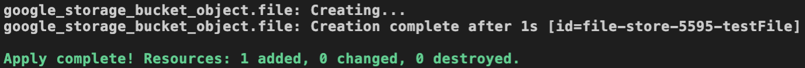

### Introduction

Terraform provides several ways to determine the order of steps to  take when deploying and managing your cloud infrastructure. One common  approach is to include implicit dependencies in your resource  configurations. These dependencies act as a chain to link resources  together in the appropriate deployment order, so that configurations  down the chain can be set dynamically.

In this lab, you will explore using implicit dependencies in Terraform to manage a Google Cloud Storage Bucket and Object.


### Instructions

1. To begin configuring your Terraform project, expand the **terraform-gcp** directory under **PROJECT** and double-click on **main.tf**:


The empty file will open in the IDE editor.

 

2. Paste the following block into the **main.tf** file, and replace the two instances of `RANDOM_NUMBERS` with a few random numbers:

```
terraform {
  required_providers {
    google = {
      source = "hashicorp/google"
      version = "3.5.0"
    }
  }
}
provider "google" {
  credentials = "${file("../.sa_key")}"
  project = "cal-1653-6fa6988400a5"
  region = "us-central1"
}
resource "google_storage_bucket" "file-store" {
  name     = "file-store-RANDOM_NUMBERS" # Replace with random numbers
  location = "US"
}
resource "google_storage_bucket_object" "file" {
  name   = "testFile"
  source = "file.txt"
  bucket = "file-store-RANDOM_NUMBERS" # Replace with random numbers
}
```

The infrastructure definition above will attempt to create two resources, a Google Cloud Storage Bucket named `file-store-bucket`, and a single `file` object.

4. Enter the command `terraform init` in the terminal to initialize the directory to be used by Terraform.


5. Enter the command `terraform apply` in the terminal

*Note*: If you come across the Terraform error below, rerun the `terraform init` command, followed by `terraform apply` once more:


You will be presented with the deployment plan which includes a Cloud Storage Bucket and Object.

6. Enter *yes* when prompted to proceed with the deployment:


The deployment will begin but quickly fail, and you will notice the following status messages:


Take note of the order of the resource deployments. Terraform  attempts to create the file object before the bucket. An object cannot  exist outside of a Cloud Storage bucket, so we can expect this  deployment to throw an error.

Another thing to note with this output is that although the object  resource wasn't created, Terraform was successful in creating the **file-store-xxxx** bucket resource.

As expected, Terraform returns the following error message:


Without an implicit dependency set between these two resources, Terraform deployed them in the incorrect order.

7. To get a visual representation of this Terraform deployment, enter the command `terraform graph` in the terminal window:


The resulting output is a visual representation of your infrastructure in dot format, commonly used with Graphviz tools. [Graphviz](https://graphviz.org/) is an open-source graph visualization software.

Terraform utilizes resource graphs to determine relationships within  your infrastructure, so graph visualizations are often used by Terraform developers to represent and diagnose problems with the resources  involved.

This output can be fed into a tool like [WebGraphViz](http://www.webgraphviz.com/), a browser-based graph visualization tool, to visualize the resources.

 

8. Navigate to [WebGraphViz](http://www.webgraphviz.com/).

This link will open in a new browser tab:


The interface includes a field to input your dot formatted output, and a graph will be rendered at the bottom of the page.

 

9. Copy the entire output of the terraform graph command and replace the contents of the field, then click **Generate Graph!**:


The graph above represents your Terraform deployment.

The two nodes to pay attention to are **google_storage_bucket.file-store**, and **google_storage_bucket_object.file**. These nodes being displayed at the same level indicate that they will be deployed at the same time.

 

10. To address this deployment order issue, return to the IDE tab and replace the `google_storage_bucket_object` resource definition in **main.tf** with the following:

```
resource "google_storage_bucket_object" "file" {
  name   = "testFile"
  source = "file.txt"
  bucket = google_storage_bucket.file-store.name # file-store bucket dependency
}
```

Your **main.tf** file should now appear as below:

### 

The `file-store-xxxx` value has been replaced with. the `google_storage_bucket.file-store.name` configuration value. This string will resolve to the `name` property of the `file-store` resource defined in this configuration file. As a result of this, the  object resource will not be created until Terraform can verify that the `file-store` resource has been successfully created.

This implicit dependency will also influence the visual representation of the deployment.

 

11. Enter the `terraform graph` command once more in the terminal window:

 

12. Copy the output then return to the browser tab with the WebGraphViz editor and generate a new graph:

### 

The updated graph displays an arrow pointing from the object resource to the bucket resource. This arrow represents the dependency you set by changing that single line of code in your **main.tf** file.

 

13. Return to the IDE tab and enter the command` terraform apply` in the terminal window:


This Terraform plan will appear with only one resource to create. This is because the `file-store-xxxx` bucket was successfully created during the first deployment attempt in this lab step. However, notice that the `bucket` value now dynamically resolves to the `name` value you have set to the bucket resource.

 

14. Confirm with *yes* when prompted to accept the resource dependency.



The deployment is now successful and your object has been added to the correct Cloud Storage bucket. 

###  

### Summary

In this lab step, you worked with the `terraform graph` command and the WebGraphViz visualization tool to explore implicit dependencies in Terraform.