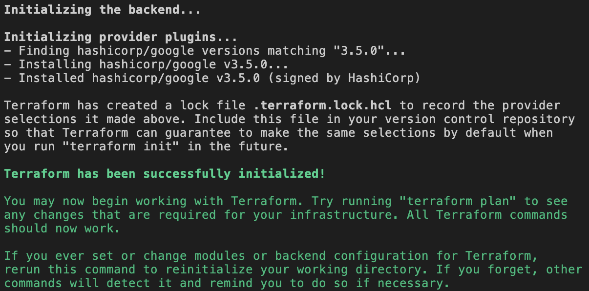
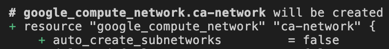
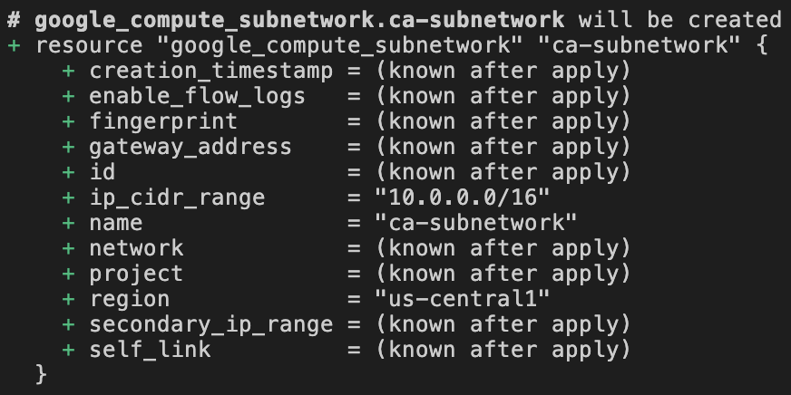
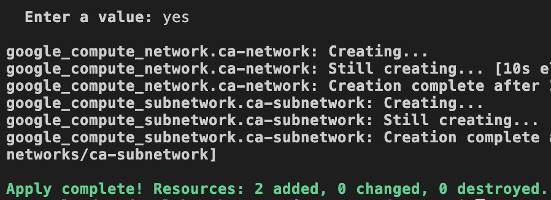
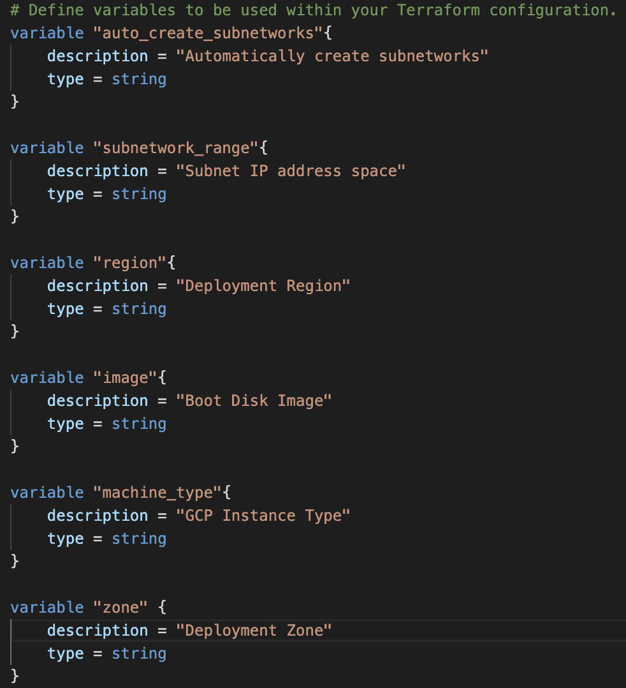
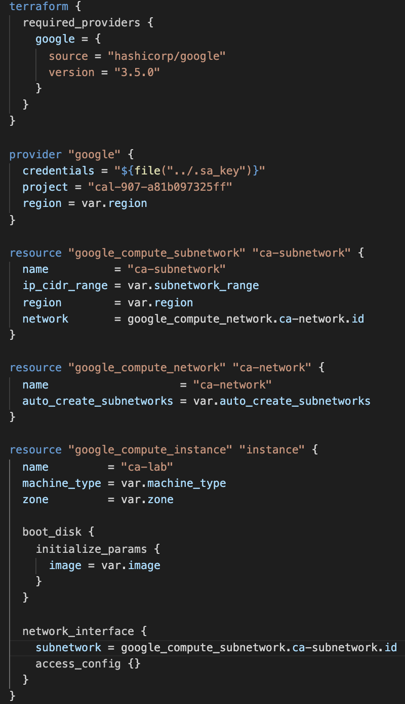
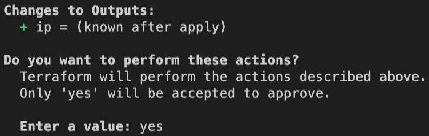
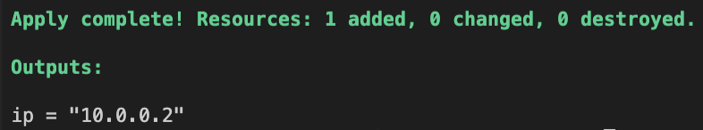

# Working with Terraform Configuration Variables in GCP

### Introduction

Variables are a core component of Terraform as they allow for  dynamically configured resources. Hard-coding your resource  configurations is generally discouraged if it prevents your code from  being reusable.

In this lab step, you will explore declaring variables and defining their values dynamically using the command line.

### Instructions

1. To begin configuring your Terraform project, expand the **terraform-gcp** directory under **PROJECT** and double-click on **variables.tf**:


The empty file will open in the IDE editor.

 

2. Paste the following block into the **variables.tf** file:

```
variable "auto_create_subnetworks" {
    description = "Automatically create subnetworks"
    type = string
}
variable "subnetwork_range" {
    description = "Subnet IP address space"
    type = string
}
variable "region" {
    description = "Deployment Region"
    type = string
}
```

Input Variables are created and declared in these variable blocks.

The variables defined in this file are related to the resource configurations you will define next in the **main.tf** file.

Each variable utilizes the `variable` declaration block  followed by its reference name. Each block declares a description of the variable and the data type that is expected.

3. From the same directory, open up the **main.tf** file and paste in the following:

```json
terraform {
  required_providers {
    google = {
      source = "hashicorp/google"
      version = "3.5.0"
    }
  }
}
provider "google" {
  credentials = "${file("../.sa_key")}"
  project = "cal-2868-cb9395d9b823"
  region = var.region
}
resource "google_compute_subnetwork" "ca-subnetwork" {
  name          = "ca-subnetwork"
  ip_cidr_range = var.subnetwork_range
  region        = var.region
  network       = google_compute_network.ca-network.id
}
resource "google_compute_network" "ca-network" {
  name                    = "ca-network"
  auto_create_subnetworks = var.auto_create_subnetworks
}
```

The definition above will create a Google Compute Engine network (`ca-network`) and subnetwork (`ca-subnetwork`).

You will notice a few instances of the `var` keyword. Input Variables are referenced as attributes on an object named `var`. When the `var` object is accessed, followed by the variable reference, Terraform will  confirm the appropriate data type is passed in and dynamically set that  value to the resource property.

Each instance of `var` is an expression to access the variable declared in the `variable.tf` file.

The first option to set these variable values involves passing values through the command line.

4. In the terminal window, enter the following command to change into the `terraform-gcp` directory:

```
cd terraform-gcp
```

5. Enter the command `terraform init` in the terminal to initialize the directory to be used by Terraform.



6. Enter the following command in the terminal to set your variables and apply the Terraform deployment:

```
terraform apply -var="region=us-central1" -var="subnetwork_range=10.0.0.0/16" -var="auto_create_subnetworks=false"
```

You run the standard `terraform apply` command to deploy your infrastructure, but this time with a value passed in for each variable defined in the **variables.tf** file.

The output returned by this command confirms the variables have been set correctly:



The `false` value for `auto_create_subnetworks` allows Terraform to create the custom subnetwork defined in this file.



In your subnetwork, the `ip_cidr_range` has been set to `10.0.0.0/16` and the region has been appropriately set to `us-central1`.

7. Enter *yes* when prompted, and deploy your resources:



Your GCP network and subnetwork have been successfully deployed using variables passed in through the command line.

### Introduction

In this lab step, you will leverage Terraform configuration files to manage input and output variables for your infrastructure.

The input variables are declared in `variables.tf` and accessed by referencing the `var` object. Output variables can be used to expose certain resource  configurations or values created after a successful Terraform  deployment.

### Instructions

1. Update the **variables.tf** file by adding the following variables and then saving the file:

```go
variable "image"{
    description = "Boot Disk Image"
    type = string
}
variable "machine_type"{
    description = "GCP Instance Type"
    type = string
}
variable "zone" {
    description = "Deployment Zone"
    type = string
}
```

The **variables.tf** file should now appear as follows:



The `image` variable will be used to define the boot disk image used to create a Compute Engine instance in this lab step. The `machine_type` will determine the instance type, and the `zone` determines the deployment zone of the instance.

2. Return to the **main.tf** file, add the following resource definition:

```
resource "google_compute_instance" "instance" {
  name         = "ca-lab"
  machine_type = var.machine_type
  zone         = var.zone
  boot_disk {
    initialize_params {
      image = var.image
    }
  }
  network_interface {
    subnetwork = google_compute_subnetwork.ca-subnetwork.id
    access_config {}
  }
}
```

The **main.tf** file should now appear as follows:



This instance definition will deploy a Compute Engine instance into the `ca-subnetwork` subnetwork you defined previously. The variables declared previously are all retrieved using the `var` keyword.

With this new resource and variables declared, you will now learn how to set all of the necessary variables in a single file.

3. From within the same **terraform-gcp** directory, double-click the **terraform.tfvars** file to open it in the editor:


4. Paste the following variable values into **terraform.tfvars**:

```
region = "us-central1"
subnetwork_range = "10.0.0.0/16"
auto_create_subnetworks = "false"
machine_type = "f1-micro"
zone = "us-central1-a"
image = "debian-cloud/debian-10"
```

During a deployment, Terraform will automatically look for a `terraform.tfvars` file in the directory and use the values in the file for each variable defined in `variables.tf`. 

Without this variable configuration file, you would need to include a `-var` argument for each variable when running the `terraform apply` command.

It is important to note that although this configuration file makes  it easier to manage your Terraform variables, it should not be used to  store your application's sensitive information.

With our input variables accessible from a centralized location, you  will now shift your focus to your infrastructure's output variables. 

5. To output the IP address of your new Compute Engine instance, double-click on the **outputs.tf** file in the current directory:


6. Paste the following code block into **outputs.tf**:

```
output "ip" {
    description = "IP address of the instance"
    value = google_compute_instance.instance.network_interface.0.network_ip
}
```

The IP address of the instance will be associated during the  deployment, so this output variable will retrieve the IP address of your instance and return it once the deployment has completed.

7. Enter the command `terraform apply` into the terminal window to deploy your resources:



The **Changes to Outputs** section displayed indicates the `ip` value will be known after the `apply`.

8. Enter *yes* when prompted to deploy your resources:



The deployment is successful, and the IP address of your newly created instance is displayed.